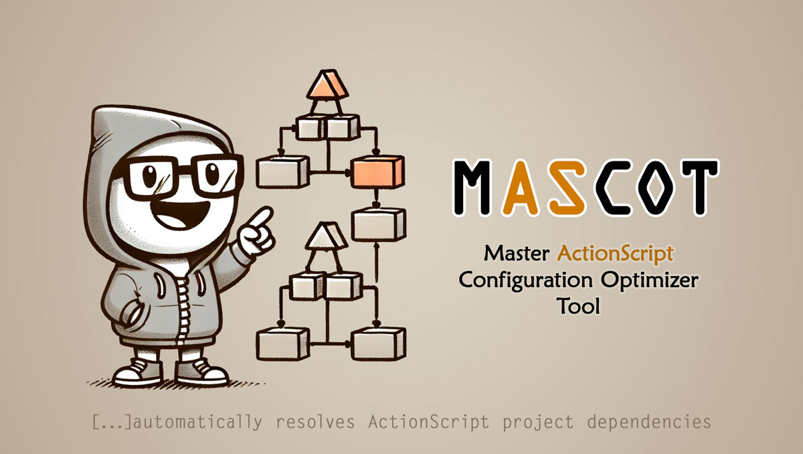
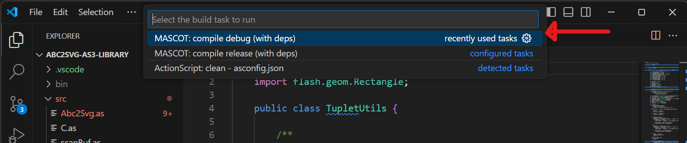
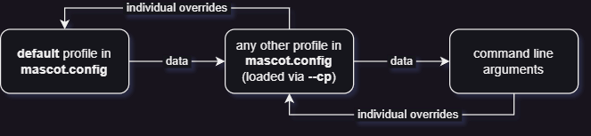
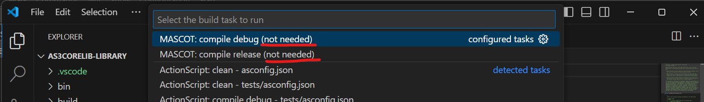

# MASCOT
### **M**aster **A**ction**S**cript **C**onfiguration **O**ptimizer **T**ool
#### **MASCOT** automatically resolves ActionScript project dependencies and generates `asconfig.json`, `settings.json` and `tasks.json` files for easier setup and compilation with [Josh Tynjala](https://www.patreon.com/josht)'s [ActionScript & MXML](https://as3mxml.com) extension for [Visual Studio Code](https://code.visualstudio.com/).

**MASCOT** streamlines the process of managing large ActionScript codebases by analyzing coupling relationships between all the classes found in all the projects of a set workspace. From here, projects dependency relationships are inferred, and configuration files are automatically generated for every project in the workspace. With these configuration files in place, building an arbitrary ActionScript project in the workspace is as simple as:
- Opening the project in Visual Studio Code.
- Triggering the _build tasks_ menu (**Ctrl+Shift+B** or **Cmd+Shift+B** by default).
- Choosing, e.g.: **MASCOT: compile debug (with deps)**.



<br/>

> **Note**: MASCOT is _not_ a Visual Studio Code extension, but a standalone Node.js module with a CLI. This means that you can either use it from the command line, like an application, or from your own Node.js code, like a package/library.

## 1. Using MASCOT From the Command Line
First, install MASCOT globally, using:
```bash
 npm install -g mascot-app
 ```
 Then, initialize a configuration file by doing:
 ```bash
 mascot-app --ic
 ```
 This will create file `mascot.config` in your user directory. The command will print the exact path of the created file. Open it in your favorite JSON editor and provide at least the `workspace_directory` and the `g_sdk_directory` information. Note that you can _override_ all the information given in the configuration file _from the command line_, at run time.

 Provide needed and accurate configuration info (see next sections for details), then call:
 ```bash
 mascot-app --g
 ```
 to have MASCOT (re)generate the `asconfig.json`, `settings.json` and `tasks.json` files, which will enable you to run the **MASCOT: compile...** build task, as previously described.

 > **Note**: remember to call `mascot-app --g` after each important change you bring to the dependency tree of your project, or else the MASCOT build tasks might fail to correctly compile your project and its dependencies.

 ### 1.1. Sample `mascot.config` file content
 The `appInfo` section is auto-generated; you only enter configuration data under the `settings` section of one or more `profiles`. See next in this document for the complete list of all configuration directives. 
 ```json
{
  "appInfo":{
    "appName":"mascot",
    "appAuthor":"Claudius Iacob <claudius.iacob@gmail.com>",
    "appVersion":"1.0.0",
    "appDescription":"Master ActionScript COnfigurator Tool. MASCOT automatically resolves ActionScript project dependencies and generates `asconfig.json` files for easy compilation with `asconfigc`."
  },
  "profiles":[
    {
      "name":"default",
      "settings":{
        "workspace_directory":"d:\\_DEV_\\github\\actionscript",
        "c_user_name":"ciacob",
        "c_programming_languages":[
          "ActionScript"
        ],
        "g_sdk_directory":"d:\\_BUILD_\\AS3\\AIR_51.1.3_Flex_4.16.1\\bin",
        "g_manual_dependencies":[
          {
            "project":"d:\\_DEV_\\github\\actionscript\\maidens",
            "dependencies":[
              "d:\\_DEV_\\github\\actionscript\\abc2svg-as3-library"
            ]
          }
        ]
      }
    }
  ]
}
 ```
> **Note**: the `g_manual_dependencies` featured above is optional information, and is only needed when MASCOT fails to automatically detect all the dependencies of a particular project.

 ### 1.2. Input Data Flow
 In the above example, all the configuration is provided under `<root>/profiles/default/settings`. You can use any name you wish for a profile name, but keep in mind that the **default** profile is always loaded by the application, so it's a very convenient place to store information that you want always available. You can also store diverging information in a subsequent profile, and load that profile at run time, via the `--cp` argument, which will override the defaults as needed.

 > **Note**: MASCOT builds a merged input dataset from (1) the `default` configuration profile, (2) any other profile loaded explicitly, via `--cp`, and (3) the command line arguments, each datasource overriding the previous one as needed.
 >
> 

### 1.3. Full List of Configuration Directives
Remember that, in order to provide a configuration value via the command line, **you must prepend two dashes** (`--`) to its name, e.g., use `c_user_name` in the configuration file, but use `--c_user_name` in the command line.

| Long Name | Short Name | General form (RegEx)                 | Description 
|-----------|------------|--------------------------------------|------------
**workspace_directory** | **wd** | `/^--(workspace_directory\|wd)=(.+)$/` | The directory where actionscript projects live. Also the directory where GitHub repositories are cloned, if requested. Mandatory; set this via configuration file, preferably.
**clone** | **c** | `/^--(clone\|c)$/` | If given, causes MASCOT to attempt to clone some GitHub repositories. Behavior is controlled via the `c_` arguments.
**c_user_name** | **c_un** | `/^--(c_user_name\|c_un)=(.+)$/` | The user name to use when cloning GitHub repositories. Mandatory if `--clone` was also given; set this via configuration file, preferably.
**c_forks_behavior** | **c_fb** | `/^--(c_forks_behavior\|c_fb)=(exclude\|only\|mix)$/` | Sets what will happen with forks when cloning repositories. One of **exclude** (forks will not be cloned), **only** (just the forks will be cloned), or **mix** (the default: both forks and non-forks will be cloned). Set this via configuration file, preferably. Accepted values: **exclude**, **only**, **mix**.
**c_programming_languages** | **c_pl** | `/^--(c_programming_languages\|c_pl)=(.+)$/` | Optional JSON Array literal of up to three programming language names to filter cloned repositories by, e.g.: `["ActionScript", "HTML"]`; set this via configuration file, preferably.
**c_dry_mode** | **c_dm** | `/^--(c_dry_mode\|c_dm)=(yes\|no)$/` | Sets whether to actually download the files when cloning (**yes**, the default) or just print information the the console (**no**), without writing anything to disk. Accepted values: **yes**, **no**.
**generate** | **g** | `/^--(generate\|g)$/` | If given, causes MASCOT to generate `asconfig.json` and other related files. Behavior is controlled via the `g_` arguments.
**g_rebuild** | **g_r** | `/^--(g_rebuild\|g_r)$/` | If given, generated `tasks.json` will not skip unchanged projects, thus causing everything to be rebuilt, changed or not. By default, only changed projects are built. All direct and indirect dependencies are scanned when determining whether a project was changed. You _must_ use this argument when switching form a _debug_ build to a _release_ build or vice-versa.
**g_sdk_directory** | **g_sdk** | `/^--(g_sdk_directory\|g_sdk)=(.+)$/` | The directory where the AIR ActionScript SDK lives. For pure AIR SDKs, this is the root folder; for FLEX & AIR combined SDKs, this is the `bin` sub-folder. Mandatory if `generate` was also given; set this via configuration file, preferably.
**g_manual_dependencies** | **g_md** | `/^--(g_manual_dependencies\|g_md)=(.+)$/` | Optional JSON Array literal of Objects having each one the keys `project` (String) and `dependencies` (Array of Strings). All strings are absolute paths to projects living under the **workspace_directory**. Up to, but not including the `src` folder. All given `dependencies` will be added to `project`. Set this via configuration file, preferably.
**g_asconfig_base** | **g_ab** | `/^--(g_asconfig_base\|g_ab)=(.+)$/` | An optional JSON object literal that serves as a base for the `asconfig.json` files generated by MASCOT. Use this to include additional directives that MASCOT does not handle, such as packaging settings or specialized build flags (e.g., `advanced-telemetry`). Do not provide any build-related directives here; they will be overwritten. Set this via configuration file, preferably.
**help** | **h** | `/^--(help\|h)$/` | Displays information about the program's input parameters and exits.
**init_config** | **ic** | `/^--(init_config\|ic)$/` | Initializes an empty configuration file in the user's home directory and exits.
**config_profile** | **cp** | `/^--(config_profile\|cp)=(.+)$/` | Loads default data from a configuration profile if it has been defined.

Remember that you can review all of the above at run time, by doing:
```bash
mascot-app --h
```
> **Note**: the **c_programming_languages**, **g_manual_dependencies** and **g_asconfig_base** pose significant challenges when given from the command line, which is why it is strongly recommended to always pass them through the configuration file. For example, in Windows, to tell MASCOT to only clone the GitHub repositories that match the programming languages _ActionScript_ and _HTML_, you would have to pass, from the command line: 
`--c_pl="[\"ActionScript\", \"HTML\"]"`
whereas, in the configuration file, you would simply give:
`"c_programming_languages":["ActionScript", "HTML"]`
which is a lot more convenient.

> **Note**: while short names should work in the configuration file too, it is recommended to use the long names instead, since they improve the file readability and  maintainability (and you anyhow only need to type them once, in-there).

> **Note**: MASCOT has a small GitHub batch cloning functionality, accessible via `--clone` (or `--c`), and configurable via the `--c_...` arguments. If you intend to use this functionality, it is recommended to set it up from the configuration file (e.g., define in-there `c_user_name`, `c_programming_languages`, etc.), and only trigger the actual cloning when needed, by passing `--c` from the command line.

### 1.4. Selective Building
From v.1.0.2, MASCOT supports **selective building**, and it is the **default behavior**. This functionality **prevents compilation of unchanged code**, which dramatically improves building speed in projects with a significant number of dependencies. MASCOT analyses the full dependencies hierarchy of the current project, and only generates building tasks for those dependency branches that contain at least one _dirty_ project.

> **Note**: a project is to be considered _dirty_ if at least one of its source files have been more recently changed than its _binary file_ (a `*.swf` or `*.swc` living in the `bin` folder, based on project type). If there is no binary file, the project is considered _dirty_ as well.

While build tasks for clean dependencies are omitted, a build task for the root project is always generated, even if it has no changes. If this is the case, the "**not needed**" suffix is added to the build task name.



If you need to **force recompilation** of a clean project, together with recompilation of all its dependencies, use the `--g_rebuild` argument (or `--g_r`):
```bash
mascot-app --g --g_r
```
This will generate the build tasks to recompile everything, changed or not. 

> **Note**: **You must always rebuild** when switching from `compile debug` to `compile release` or vice-versa, or otherwise you risk creating a _mixed build_. **Debug binary code** runs slower due to all additional hooks and information in-there (i.e., stack-traces), while **release binary code** fails to display trace messages and doesn't connect to the debugger. Each can create unexpected results when placed in the wrong context, so its way better to rebuild when switching build type.

> **Note**: MASCOT only analyzes your workspace when invoked via `mascot-app --g`. You **must** call `mascot-app --g` prior to executing any of the `MASCOT: compile...` tasks, otherwise MASCOT might use an obsolete context (e.g., considering a dependency project is _clean_ while it is actually _dirty_, which would result in an outdated dependency binary being used).

### 1.5. `Asconfig` Base
From v.1.0.5, MASCOT allows you to specify a _base_ (or "blueprint") for all generated `asconfig.json` files. This allows you to include persistent settings in-there, such as AIR packaging options (e.g., `airOptions`) or specialized compiler flags (e.g., `advanced-telemetry`). This kind of settings would be overwritten if you were to add them directly into each generated `asconfig.json` file, not to mention all the effort.

You set a _base_ for all `asconfig.json` files by passing a JSON Object literal to the `g_asconfig_base` (or `g_ab`) configuration directive, either from the command line or from the configuration file (`mascot-app.config`, highly recommended). The structure you pass to `g_asconfig_base` must exactly match the [genuine structure of `asconfig.json`](https://github.com/BowlerHatLLC/vscode-as3mxml/wiki/asconfig.json).

For example, to have MASCOT generate build tasks compatible with the **Adobe Scout** profiler, you would do:
```json
{
  "appInfo":{
    "...":"..."
  },
  "profiles":[
    {
      "name":"default",
      "settings":{
        "workspace_directory":"...",
        "...":"...",
        "g_asconfig_base":{
          "compilerOptions":{
            "advanced-telemetry":true
          }
        }
      }
    }
  ]
}
```
Most of the above example has been omitted for brevity; just observe that `g_asconfig_base` holds an Object with `compilerOptions/advanced-telemetry=true`, because, in a genuine `asconfig.json` file, you would place the `advanced-telemetry` under `compilerOptions`.

You can leverage the _profiles_ support in the configuration file of MASCOT. Since all profiles inherit from **default**, you could place non-permanent settings in dedicated profiles, and load those only when needed, via `--cp`. E.g., in `mascot-app.config`:
```json
{
  "appInfo":{
    "...":"..."
  },
  "profiles":[
    {
      "name":"default",
      "settings":{
        "workspace_directory":"...",
        "...":"..."
      }
    },
    {
      "name":"scout",
      "settings":{
        "g_asconfig_base":{
          "compilerOptions":{
            "advanced-telemetry":true
          }
        }
      }
    }
  ]
}
```
Then, wen you need to generate build tasks that would result in **Adobe Scout** compatible binaries, form the command line do:
```
mascot-app --cp=scout --g --g_r
```
This would inject the `advanced-telemetry` in all generated `asconfig.json` files, resulting in `*.swf` and/or `*.swc` files containing telemetry data that the profiler can use. Note that the `--g_r` above (i.e., _rebuild everything_) is only needed when switching from the _normal_ build to the _telemetry_ build; you can leave that out in subsequent calls, for efficiency.

> **Note**: Do not place under `g_asconfig_base` values that are regulated by some other logic or configuration of MASCOT, such as `library-path`, `output`, `source-path`, etc., as **they will be overwritten**.

## 2. Using MASCOT From Code
MASCOT is also a CommonJS module. For your convenience, the `own_modules/core.js` module re-exports in one place all the functions exported by all the other modules, so in order to access the API of MASCOT in your code you could simply install it locally:
```bash
 npm install mascot-app
 ```
 then require everything from `core.js`:
 ```javascript
 const {
  cloneRepos,
  cloneRepo,
  doShallowScan,
  doDeepScan,
  manuallyAddDependencies,
  buildDependencies,
  makeBuildTasks,
  applyDirtinessFilter,
  writeConfig,
  writeVSCSettings,
  writeVSCTasks,
} = require ('/path/to/core.js'); // usually: mascot-app/core

// Example: collect all classes from all the ActionScript folders in the workspace and store them
// under `/path/to/cache_dir/projects.json`.
doShallowScan ('/path/to/workspace_dir', '/path/to/cache_dir', true);
 ```

Please refer to the specific [source files](https://github.com/ciacob/MASCOT/tree/master/own_modules) on GitHub for the documentation of each of the above mentioned functions.

## 3. Releases
Make sure to frequently check the [Releases](https://github.com/ciacob/MASCOT/releases) section on GitHub for information on the changes, known issues and limitations of each released version of **MASCOT**. The version currently on the `master` GitHub branch should be considered as _nightly build_, and its use is discouraged.
